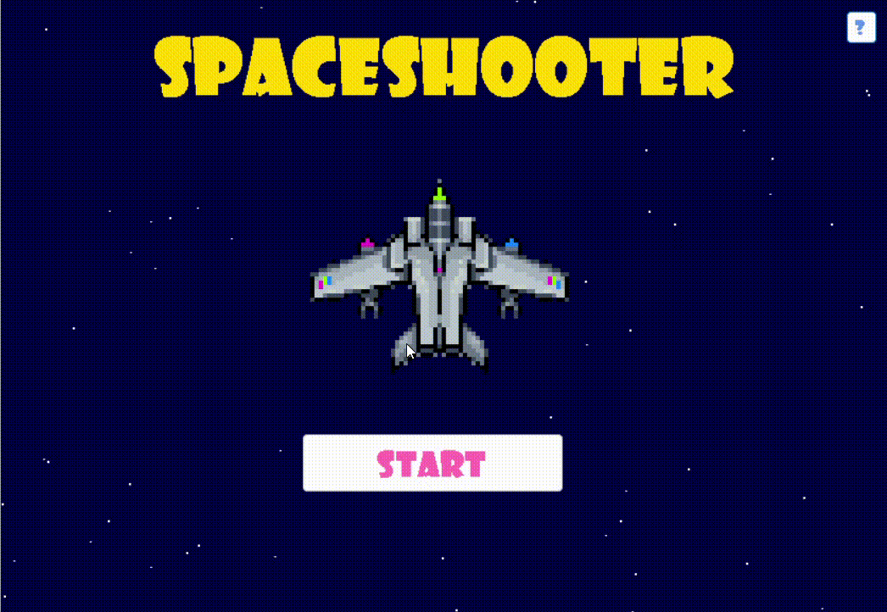
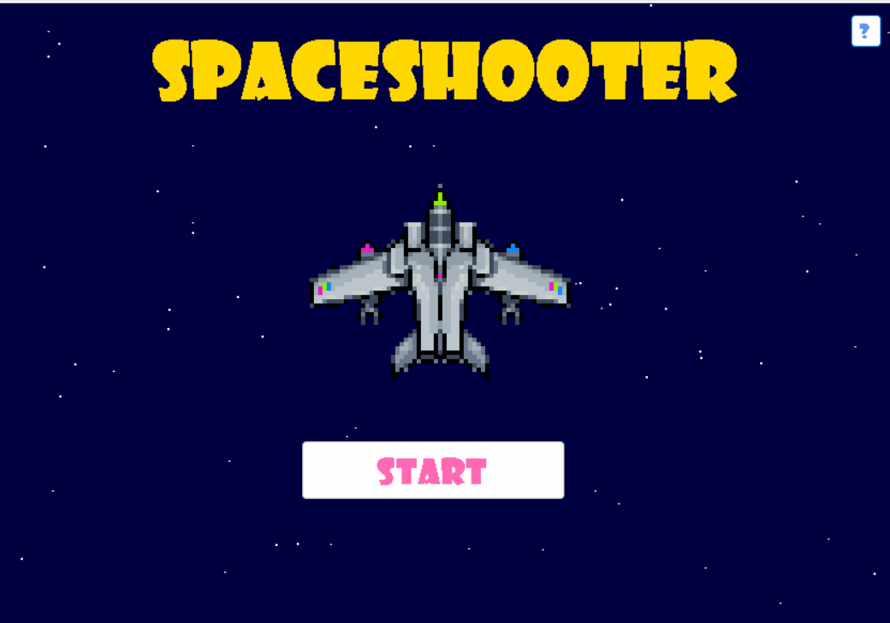
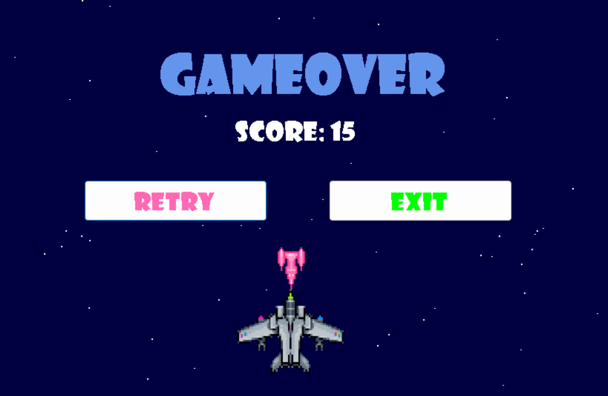

# 🚀 Space Shooter Game

A simple Space Shooter game developed using C# and Windows Forms (.NET).

## 🎮 Features

- Player spaceship movement (left and right)
- Animated star background
- Multiple enemy spaceships
- Automatic shooting system
- Score counter
- Enemy collision detection
- Game Over screen
- Retry and Exit options
- Sound effects

## 🛠 Technologies Used

- C#
- Windows Forms (.NET)
- Visual Studio

## 📷 Gameplay

The player controls a spaceship and must destroy enemy ships while avoiding collisions. Each enemy destroyed increases the score. The game ends when the player collides with an enemy.

## Gameplay

## Screenshots

## 🚀 How to Run

1. Clone the repository:
git clone https://github.com/Salamkhatallah/SpaceShooter.git

2. Open the solution file in Visual Studio.

3. Build and run the project.
